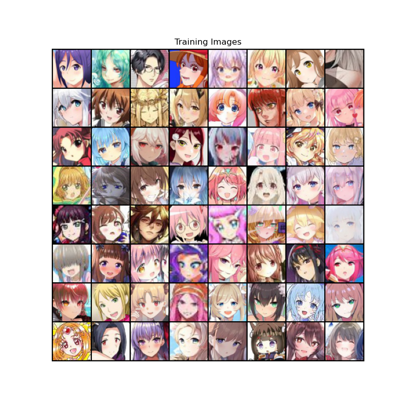
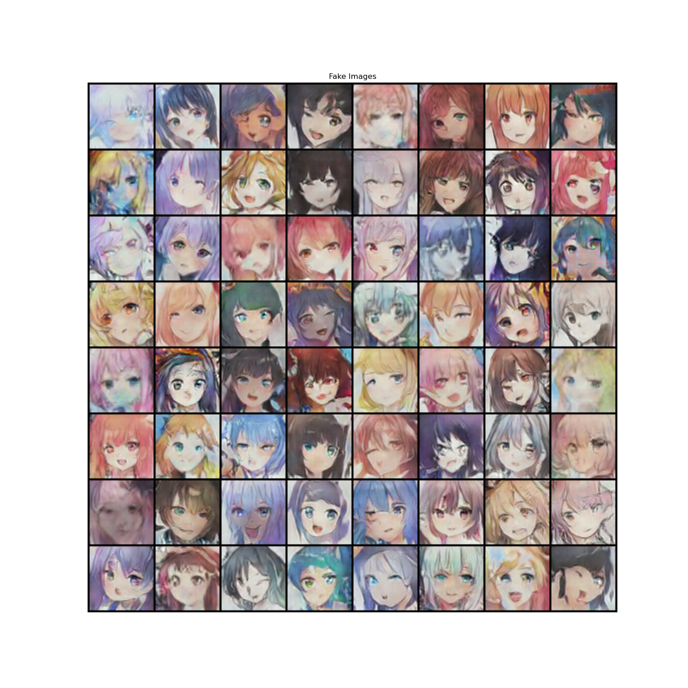

# waifuGAN

This is a waifuGAN, a DCGAN network trained to generate anime faces, implemented in PyTorch with data taken from [zerochan.net](https://www.zerochan.net/) and cropped using OpenCV. 

## Data Collection

Data was scraped from [zerochan.net](https://www.zerochan.net/). There's a lot of high-quality existing datasets out there like [this](https://github.com/bchao1/Anime-Face-Dataset) and [this](https://www.kaggle.com/subinium/highresolution-anime-face-dataset-512x512), but none of them that I found used zerochan so I thought I'd try it out. I did try pixiv at first just because the art on there is cool/high quality, but I got blocked by 403 errors. Zerochan worked pretty well for this project though.
There's a bunch of pages on Zerochan: recent, popular (with different date range options), etc. Through just browsing, I decided to only use the following pages to scrape for images:
1. Popular (current day)
2. Popular (last week)
3. Popular (last 3 months)

I didn't use popular all time and recent because they were populated with both lower quality images and also very large images that were too big for my dataset. The dataset I used was collected/scraped on August 10th, 2021: ~30,000 raw images were scraped. [Dataset linked here](https://drive.google.com/drive/folders/1tfsOn0kAV3fmjNpQdmh-jDorHntJHyek?usp=sharing)

## Dataset Preparation

I used [lbpcascade_animeface](https://github.com/nagadomi/lbpcascade_animeface) as my face detector. Not perfect, but works well enough.  
It turns out Pytorch's resize transform is more powerful than I expected. Didn't know it could scale up, so initial implementations included checking for faces that were too small, but the current implementation doesn't use this and insteads takes all images, regardless of size. Very nice and beefs up the dataset a lot. 
There was some corrupt images, but in total ~14,000 faces were exported. 

Full cropped dataset linked [here](https://drive.google.com/drive/folders/1tfsOn0kAV3fmjNpQdmh-jDorHntJHyek?usp=sharing), some examples of the face crops are shown below:

top right corner ???? 
## Model/Results
I did roughly 10 runs with different parameters. Here is a sample image set I generated with the trained model:

 

My final models are in assets/example_trained_model; feel free to download those and then run generate.py to get some more images (change the random seed in the file).  

A couple observations I had while training:
1. **Batch size needs to be small.** I found the 128 batch size used in the DCGAN paper to be way too big; my "final" version had a batch size of 16. In DCGANs, the discriminator is updated first before the generator. Because of this, the discriminator can get too good, too fast if we feed too much data in the beginning. It then outperforms the generator consistently and doesn't create a healthy competitive environment for the two to train. It's like pitting Michael Phelps against me in swimming. Nobody gains anything from it since the outcome is clear - I'd obviously win. 
2. **More epochs does not mean better.** I tried running some longer models (upwards of 400 epochs with batch size 32), but the performance didn't get much better/even got worse. In fact, because using a smaller batch size is better, using less epochs is even more necessary since we end up updating the models more simply from having more batches. 
3. It may be worth to play around with the learning rates of the discriminator and generator. This is probably useful, as it could mitigate the necessity to use a smaller batch size since the discriminator loses the genetics battle and simply learns slower.

In conclusion:

## Limitations/Future Improvements
### Different art styles
 

Since I used an open source website and people draw art/anime in different ways, there's a lot of variety in how the faces are drawn (i.e. noise for the model). It makes it more difficult to model compared to human faces or a homogenous (maybe only from one artist) dataset. The face identifier/cropper seems to only be trained on a subset of anime faces, so it only selects what it recognizes as a face, but as displayed above, there is still a drastic difference between the art styles. 
### Implementing my own face detector
Instead using someone else's (mildly outdated) face detector, I plan on creating my own face detector. The one I used was okay, but there are definitely some bad crops (I won't show any, since they're borderline NSFW). Eliminating those should improve performance, though there weren't that many. 
